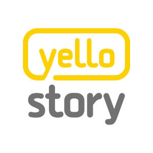

# Moood,

배움에 목마른 우물 속의 프론트엔드 개발자  
`#javascript` `#typescript` `#vanillajs` `#reactjs` `#nodejs`

<table>
<colgroup>
    <col width="150px" />
    <col />
</colgroup>
<tr style="border-top: 1px solid hsla(0,0%,0%,0.12);">
    <th>Name</th>
    <td>Kwon Hyungjoo</td>
</tr>
<tr>
    <th>Email</th>
    <td><a href="mailto:iam@hyungdew.com">iam@hyungdew.com</a></td>
</tr>
<tr>
    <th>Blog</th>
    <td><a href="https://moood.dev">https://moood.dev</a></td>
</tr>
<tr>
    <th>Github</th>
    <td><a href="https://github.com/moodselah" target="_blank">https://github.com/moodselah</a></td>
</tr>
</table>

<h1 style="margin-bottom: 1.7rem;">Work Experiences</h1>

    

<h3 style="margin-top: 2.2rem; margin-bottom: 1.6rem; padding-left: 50px;">OKCoin Korea

<table>
<colgroup>
    <col width="150px" />
    <col />
</colgroup>
<tr style="border-top: 1px solid hsla(0,0%,0%,0.12);">
    <th>Period</th>
    <td>2018.06 ~ </td>
</tr>
<tr>
    <th>Position</th>
    <td>FrontEnd Engineer</td>
</tr>
<tr>
    <th style="vertical-align: top">Projects</th>
    <td style="word-break: break-all">OKEx Korea React Native App, OKEx Korea React Web (2019.08 ~ ing)</td>
</tr>
<tr>
    <th style="vertical-align: top">Tech Experience</th>
    <td style="word-break: break-all">aws, typescript, websocket, webworker, reactjs, reactnative, redux, scss, lodash, express, webpack, babel, nginx, pm2</td>
</tr>
</table>

    

<h3 style="margin-top: 2.6rem; margin-bottom: 1.6rem; padding-left: 50px;">Vitalhint Korea

<table>
<colgroup>
    <col width="150px" />
    <col />
</colgroup>
<tr style="border-top: 1px solid hsla(0,0%,0%,0.12);">
    <th>Period</th>
    <td>2017.10 ~ 2018.05</td>
</tr>
<tr>
    <th>Position</th>
    <td>FrontEnd Engineer</td>
</tr>
<tr>
    <th style="vertical-align: top">Projects</th>
    <td style="word-break: break-all">Haemuknamnyo Mobile Commerce Web(<a href="https://m.haemukja.com/store" target="_blank">https://m.haemukja.com/store</a>), Google Assistant</td>
</tr>
<tr>
    <th style="vertical-align: top">Tech Experience</th>
    <td style="word-break: break-all">aws, reactjs, redux, scss, lodash, express, webpack, babel, nginx, pm2</td>
</tr>
</table>

    

<h3 style="margin-top: 2.6rem; margin-bottom: 1.6rem; padding-left: 50px;">YelloStory

<table>
<colgroup>
    <col width="150px" />
    <col />
</colgroup>
<tr style="border-top: 1px solid hsla(0,0%,0%,0.12);">
    <th>Period</th>
    <td>2015.01 ~ 2017.10</td>
</tr>
<tr>
    <th>Position</th>
    <td>Web Developer</td>
</tr>
<tr>
    <th style="vertical-align: top">Projects</th>
    <td style="word-break: break-all">No 1. Influencer Marketing Platform Weble(<a href="https://weble.net" target="_blank">https://weble.net</a>), CRM</td>
</tr>
<tr>
    <th style="vertical-align: top">Tech Experience</th>
    <td style="word-break: break-all">aws, angularjs 1.5.x, typescript, bootstrap, less, lodash, express, webpack, gulp, nginx, pm2, gitlab, gitlab-ci</td>
</tr>
</table>

<h3 style="margin-top: 2.6rem; margin-bottom: 1.6rem; ">T&C Partner</h3>

<table>
<colgroup>
    <col width="150px" />
    <col />
</colgroup>
<tr style="border-top: 1px solid hsla(0,0%,0%,0.12);">
    <th>Period</th>
    <td>2012.08 ~ 2015.01</td>
</tr>
<tr>
    <th>Position</th>
    <td>Software Engineer</td>
</tr>
<tr>
    <th style="vertical-align: top">Projects</th>
    <td style="word-break: break-all">Hyundai Rotem Railway Integrated Design System, Huvitz Product Data Management</td>
</tr>
<tr>
    <th style="vertical-align: top">Tech Experience</th>
    <td style="word-break: break-all">mql, enovia, java, jquery, spring framework, dojo framework, postgreSQL, hibernate, svn</td>
</tr>
</table>

# Personal Projects

### 따릉아부탁해

<table style="margin-bottom: 2.6rem">
<colgroup>
    <col width="150px" />
    <col />
</colgroup>
<tr style="border-top: 1px solid hsla(0,0%,0%,0.12);">
    <th>Description</th>
    <td>서울시 따릉이 앱</td>
</tr>
<tr>
    <th>Link</th>
    <td style="word-break: break-all"><a href="https://apps.apple.com/app/id1481744372" target="_blank">https://apps.apple.com/app/id1481744372</a></td>
</tr>
<tr>
    <th style="vertical-align: top">Tech Experience</th>
    <td style="word-break: break-all">swift 5.1, reswift, navermap, alamofire</td>
</tr>
</table>

### Moodselah

<table style="margin-bottom: 2.6rem">
<colgroup>
    <col width="150px" />
    <col />
</colgroup>
<tr style="border-top: 1px solid hsla(0,0%,0%,0.12);">
    <th>Description</th>
    <td>Cafe SNS</td>
</tr>
<tr>
    <th>Link</th>
    <td style="word-break: break-all"><a href="https://moodselah.com" target="_blank">https://moodselah.com</a></td>
</tr>
<tr>
    <th style="vertical-align: top">Tech Experience</th>
    <td style="word-break: break-all">typescript, reactjs, graphql, webpack, babel, express, typeorm, kakaomap</td>
</tr>
</table>

### Delibee

<table style="margin-bottom: 2.6rem">
<colgroup>
    <col width="150px" />
    <col />
</colgroup>
<tr style="border-top: 1px solid hsla(0,0%,0%,0.12);">
    <th>Description</th>
    <td>Delivery tracking library on Node.js</td>
</tr>
<tr>
    <th>Link</th>
    <td style="word-break: break-all"><a href="https://moodselah.github.io/delibee" target="_blank">https://moodselah.github.io/delibee</a></td>
</tr>
<tr>
    <th style="vertical-align: top">Tech Experience</th>
    <td style="word-break: break-all">cheerio, puppeteer, iconv-lite</td>
</tr>
</table>

### Deep Link

<table style="margin-bottom: 2.6rem">
<colgroup>
    <col width="150px" />
    <col />
</colgroup>
<tr style="border-top: 1px solid hsla(0,0%,0%,0.12);">
    <th>Description</th>
    <td>Redirecting iOS/Android App from your Web</td>
</tr>
<tr>
    <th>Link</th>
    <td style="word-break: break-all"><a href="https://github.com/moodselah/deep-link" target="_blank">https://github.com/moodselah/deep-link</a></td>
</tr>
<tr>
    <th style="vertical-align: top">Tech Experience</th>
    <td style="word-break: break-all">webpack, babel</td>
</tr>
</table>

### Simple Basket

<table style="margin-bottom: 2.6rem">
<colgroup>
    <col width="150px" />
    <col />
</colgroup>
<tr style="border-top: 1px solid hsla(0,0%,0%,0.12);">
    <th>Link</th>
    <td style="word-break: break-all"><a href="https://appsto.re/kr/g8hjib.i" target="_blank">https://appsto.re/kr/g8hjib.i</a></td>
</tr>
<tr>
    <th style="vertical-align: top">Tech Experience</th>
    <td style="word-break: break-all">swift, cocoapods, snapkit, realm</td>
</tr>
</table>

### Realtime Vote Festival

<table>
<colgroup>
    <col width="150px" />
    <col />
</colgroup>
<tr style="border-top: 1px solid hsla(0,0%,0%,0.12);">
    <th style="vertical-align: top">Tech Experience</th>
    <td style="word-break: break-all">express, socket.io, reactjs, redux, less, sequelize, mariadb</td>
</tr>
</table>
 

_Thank you for reading my resume. If you want to contact me, Please send me an email._
