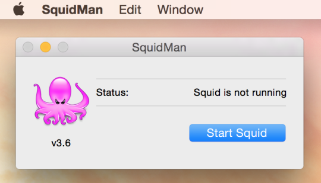
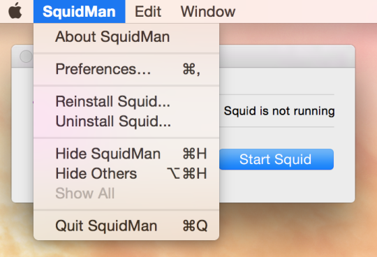
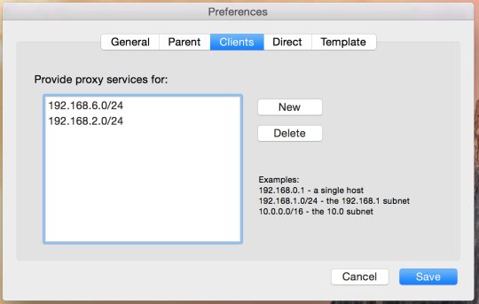
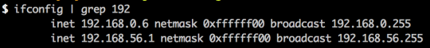
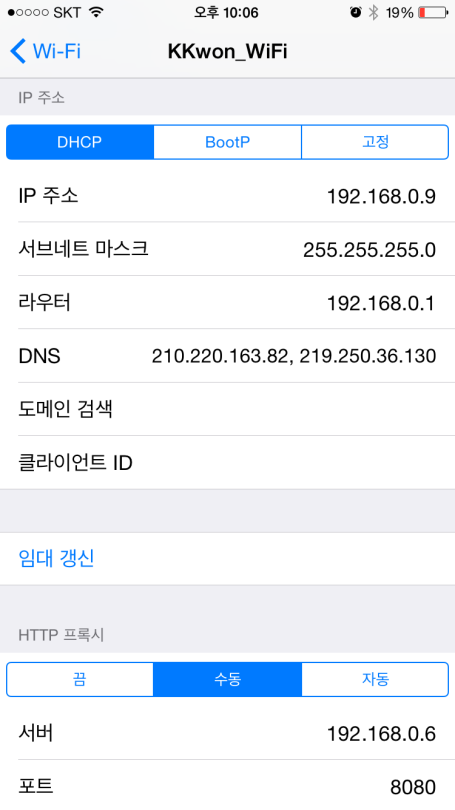

가상머신을 통해 개발서버를 돌리다 보면, 실제 스마트폰 기기에서 모바일 화면을 확인해보고 싶은 경우가 있습니다.  
기존에는 bind9을 사용했었는데, 동료의 도움으로 프록시를 통한 방식으로 더 편하게 구축할 수 있었습니다.

이 글에서는 bind9을 사용하지 않고 제 컴퓨터의 `/etc/hosts`파일을 통해 스마트폰 기기에서 접속하는 방법을 소개합니다.  
맥을 프록시 서버로 활용해 스마트폰에서 맥을 경유하여 접속하는 방법입니다.  

간단하게 프록시 서버를 구성해주는 [SquidMan](http://squidman.net/squidman)을 사용하여 구성해보도록 하겠습니다.

 

---

 

<a href="http://squidman.net/squidman" target="_blank">SquidMan 웹사이트</a>에서 SquidMan을 다운받아 설치 후에 실행하시면, 아래처럼 SquidMan의 상태가 표시됩니다.

설정을 해주셔야 하는데, <b>SquidMan->Preferences</b>을 통해 환경설정을 하실 수 있습니다.

<b>Preferences->Clients</b>에서 프록시 서버를 통해 접속을 허용할 아이피 대역을 설정합니다.

클라이언트 접속 허용을 해주지 않으면 접근 거부 메시지만 보입니다.

허용하고자 하는 클라이언트 정보를 입력하시고, 전체 허용하고자 하는 경우에는 **all**을 입력하면 됩니다.

Save후에 상태창에서 **Start Squid**버튼을 누르면, 프록시 서버가 구동됩니다.  
이제, 스마트폰의 와이파이 설정에서 프록시 서버를 설정해주시면, PC의 **/etc/hosts** 파일 및 **DNS 서버**를 경유해 웹사이트들에 접속을 하게 됩니다.

> `/etc/hosts` 파일을 수정하신 경우에는 `SquidMan`을 재시작 해주셔야 합니다. **(Stop Squid->Start Squid)**

다음으로 스마트폰으로 프록시 서버를 설정하는 방법을 살펴 보겠습니다.  
이번 포스팅에서는 아이폰으로 설정하는 방법을 다룹니다.

아이폰에서 프록시를 설정하기 전에, 맥(프록시 서버)의 IP를 확인합니다.

**192.168.0.6** 이네요.

아이폰의 `설정-Wi-Fi`에 들어갑니다. 다음으로 무선 네트워크의 설정 창으로 이동합니다.
무선 네트워크 설정 화면으로 이동하시면, 아래와 같은 화면이 보입니다.

위 화면에서 HTTP 프록시를 설정해주시면 되는데, 기본적으로 ‘끔'으로 설정이 되어있습니다.  
해당 설정을 ‘수동'으로 변경 후에, 서버와 포트를 입력해주시면 됩니다.

포트는 SquidMan에서 따로 변경하지 않으셨다면, **8080**을 사용합니다.

설정을 마치고 난 후에 아이폰을 통해 개발 중인 사이트를 접속을 시도하시면 `/etc/hosts` 설정에 따라 접속되는 것을 확인하실 수 있습니다.
