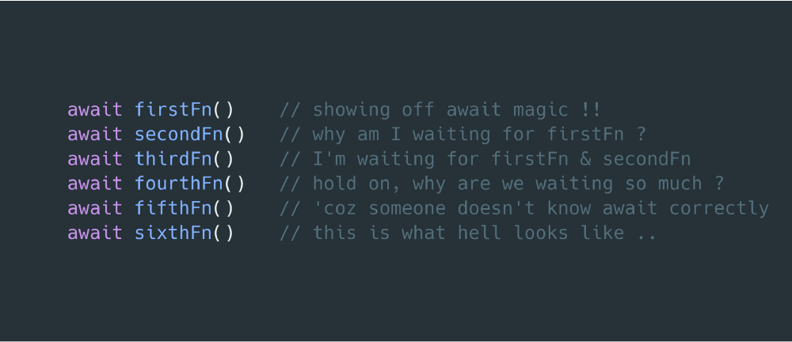

이 글은 Aditya Agarwal의 How to escape async/await hell를 번역한 글입니다.  
원문: https://medium.freecodecamp.org/avoiding-the-async-await-hell-c77a0fb71c4c
<br><br>

<br>
async/await은 우리를 콜백 지옥에서 탈출하게 해줬습니다만, 반대로 사람들은 async/await을 남용하기 시작했습니다. — async/await 지옥의 탄생  
이 글에서 저는 async/await 지옥이 무엇인지 설명하고, async/await 지옥에서 탈출하기 위한 몇 가지 노하우를 공유하고자 합니다.

## async/await 지옥이란?

비동기적인 자바스크립트를 사용하는 동안, 사람들은 종종 함수 앞에 **await**을 붙여 여러 구문을 번갈아 작성합니다. 이때 하나의 명령문은 이전 명령문과 관련이 없기 때문에 성능적으로 문제가 발생합니다. — 당신은 이전 명령문 하나가 완료될 때까지 기다려야 합니다.

## async/await 지옥의 예

당신이 피자와 음료를 주문하는 스크립트를 작성했다고 가정해봅시다.
아마, 그 스크립트는 아래와 같을 것입니다.

```javascript
(async () => {
  const pizzaData = await getPizzaData() // async call
  const drinkData = await getDrinkData() // async call
  const chosenPizza = choosePizza() // sync call
  const chosenDrink = chooseDrink() // sync call
  await addPizzaToCart(chosenPizza) // async call
  await addDrinkToCart(chosenDrink) // async call
  orderItems() // async call
})()
```
겉으로 보기에는 올바르고 잘 작동하는 것처럼 보입니다. 하지만 이러한 코드는 동시성을 벗어나기 때문에, 좋은 구현은 아닙니다. 이제 코드가 어떻게 실행되는지 살펴보고 문제를 해결해봅시다.  
<br>

### 설명

우리는 우리의 코드를 async IIFE로 감쌌습니다. 이 코드는 아래와 같은 순서로 실행될 것입니다.  
  
1. 피자들의 목록을 가져옵니다.  
2. 음료들의 목록을 가져옵니다.  
3. 목록에서 하나의 피자를 고릅니다.  
4. 목록에서 하나의 음료를 고릅니다.  
5. 고른 피자를 하나의 카트(장바구니)에 담습니다.  
6. 고른 음료를 하나의 카트(장바구니)에 담습니다.  
<br>

### 그래서 뭐가 문제죠?

앞에서 언급했던 것처럼, 위의 모든 명령문은 하나씩 실행됩니다. 여기에는 동시성이 없습니다.  
왜 음료수 목록을 가져오기 전에 피자 목록을 가져오길 기다려야 될까요? 우리는 그냥 두 개의 목록을 동시에 가져오도록 해야 합니다. 하지만 피자를 고를 땐 피자들의 목록을 미리 가져와야 됩니다. 음료도 마찬가지입니다.  
결과적으로, 우리는 피자와 관련된 작업과 음료에 관련된 작업 모두 동시에 끝낼 수 있습니다.  
그러나 피자에 관련된 개별 단계는 순차적으로 하나씩 진행돼야 합니다.  
<br>

### 나쁜 구현의 또 다른 예

아래의 자바스크립트는 카트에 담겨있는 아이템을 가져와 주문하는 스니핏입니다.

```javascript
async function orderItems() {
  const items = await getCartItems() // async call
  const noOfItems = items.length
  for (var i = 0; i < noOfItems; i++) {
    await sendRequest(items[i]) // async call
  }
}
```

이 경우 for 반복문은 다음 반복을 실행하기 전에 sendRequest() 함수가 완료될 때까지 기다려야 합니다. 그러나 실제로 기다릴 필요는 없습니다. 우리는 모든 반복 요청을 가능한 한 빨리 보내고 요청들이 완료될 때까지 기다릴 수 있습니다.  

저는 이제 당신이 async/await 지옥은 무엇이고, 프로그램 성능에 얼마나 심각한 영향을 미치는지에 대해 감을 잡았기를 바랍니다. 이제, 저는 당신에게 질문 하나를 던지고 싶습니다.  

## 만약 우리가 await 키워드를 빼먹는다면?

async 함수를 호출할 때 await을 빼먹어도 함수는 바로 실행됩니다. 즉, 함수를 실행하는 데에 await은 필수적이지 않습니다. async 함수는 promise를 반환할 것이고, 당신은 그 promise를 나중에 사용할 수 있습니다.

```javascript
(async () => {
  const value = doSomeAsyncTask()
  console.log(value) // an unresolved promise
})()
```

다만 중요한 점은 컴파일러는 함수가 완전히 실행될 때까지 기다리고 싶다는 것을 알지 못한다는 것입니다. 때문에 컴파일러는 async 작업을 마치지 않고 프로그램을 종료합니다. 그래서 우리는 await 키워드가 필요한 것입니다.  

promise에서 한 가지 재미있는 점은 한 라인에서 promise을 가져오고, 다음 라인에서 promise가 resolve 될 때까지 기다릴 수 있다는 것입니다. 이것은 async/await 지옥을 탈출하는 열쇠입니다.  

```javascript
(async () => {
  const promise = doSomeAsyncTask()
  const value = await promise
  console.log(value) // the actual value
})()
```

보시다시피 doSomeAsyncTask()는 promise를 반환합니다. 이 반환 시점에서 doSomeAsyncTask()는 이미 실행을 시작했습니다. promise의 resolve 값을 얻기 위해 await 키워드를 사용하면, 자바스크립트가 다음 라인을 즉시 실행하지 않는 대신에 promise가 resolve 될 때까지 기다리고 다음 라인을 실행합니다.  

## 어떻게 async/await 지옥에서 빠져나올까요?

async/await 지옥을 탈출하기 위해서는 아래의 단계를 따라야 합니다.  
<br>

### 다른 명령문에 의존하는 명령문을 찾으세요.

첫 번째 예에서는 피자와 음료를 골랐습니다. 우리는 피자를 고르기 전에 피자 목록을 가지고 있어야 한다고 얘기했습니다. 또 피자를 장바구니에 담기 전에는 피자를 먼저 골라야 합니다. 따라서 우리는 이 세 단계가 서로 의존된다고 말할 수 있습니다. 즉, 이전 작업이 끝날 때까지 다음 작업을 진행할 수는 없습니다.  

그러나 좀 더 광범위하게 살펴보면 피자를 고르는 것과 음료를 고르는 것은 서로 무관하기 때문에 우리는 피자와 음료를 동시에 고를 수 있음을 알 수 있습니다. 이것은 우리가 작성했던 것보다 더 나은 코드를 작성할 수 있는 한 가지 방법입니다.  

이렇게 우리는 다른 명령문에 의존하는 명령문과 그렇지 않은 명령문을 찾았습니다.  
<br>

### 의존적인 명령문들을 async 함수로 그룹화하세요.

우리가 살펴보았듯이, 피자를 고를 때 피자 목록을 가져와 하나를 고르고 나서, 장바구니에 담는 것처럼 이는 의존적인 명령문을 포함합니다. 우리는 이러한 명령문들을 async 함수로 묶어야 합니다. 이 방법은 두 개의 async 함수, selectPizza()와 selectDrink()를 실행할 수 있도록 합니다.  
<br>

### 그룹화 한 async 함수들을 동시에 실행하세요.

그런 다음 async non blocking 함수를 동시에 실행하기 위해 이벤트 루프를 이용합니다. 이 작업을 수행하는 두 가지 일반적인 패턴은 promise들을 일찍 반환하고 Promise.all 메서드를 사용하는 것입니다.
<br>

## 예제들을 수정해봅시다.

위 세 단계를 통해서, 우리 예제에 적용해 보겠습니다.

```javascript
async function selectPizza() {
  const pizzaData = await getPizzaData() // async call
  const chosenPizza = choosePizza() // sync call
  await addPizzaToCart(chosenPizza) // async call
}
async function selectDrink() {
  const drinkData = await getDrinkData() // async call
  const chosenDrink = chooseDrink() // sync call
  await addDrinkToCart(chosenDrink) // async call
}
(async () => {
  const pizzaPromise = selectPizza()
  const drinkPromise = selectDrink()
  await pizzaPromise
  await drinkPromise
  orderItems() // async call
})()
// 저는 아래 방식을 더 선호합니다.
(async () => {
  Promise.all([selectPizza(), selectDrink()]).then(orderItems) // async call
})()
```

자, 우리는 명령문을 두 가지 함수로 그룹화하고 selectPizza() 및 selectDrink() 함수를 동시에 실행했습니다. 함수 내에서 각 구문은 이전 구문의 실행에 의존됩니다.  

두 번째 예제에서는 개수를 알 수 없는 promise들을 처리할 것입니다. 이 상황을 다루는 것은 매우 쉽습니다. 배열을 만들고 promise들을 push 하면 됩니다. 그러면 Promise.all()을 통해 모든 promise들이 동시에 resolve 될 때까지 기다릴 수 있습니다.  

```javascript
async function orderItems() {
  const items = await getCartItems() // async call
  const noOfItems = items.length
  const promises = []
  for(var i = 0; i < noOfItems; i++) {
    const orderPromise = sendRequest(items[i]) // async call
    promises.push(orderPromise) // sync call
  }
  await Promise.all(promises) // async call
}
// 저는 아래 방식을 더 선호합니다.
async function orderItems() {
  const items = await getCartItems() // async call
  const promises = items.map((item) => sendRequest(item))
  await Promise.all(promises) // async call
}
```

저는 이 글이 당신의 애플리케이션 성능을 향상하고, async/await를 이해하는 데에 도움이 되었으면 합니다.

마음에 들면 clap을 눌러주세요! 페이스북이랑 트위터에도 공유해주세요. 업데이트를 받으려면 Twitter나 Medium에서 저를(=Aditya Agarwal) 팔로우하시면 됩니다.

<br>
<br>