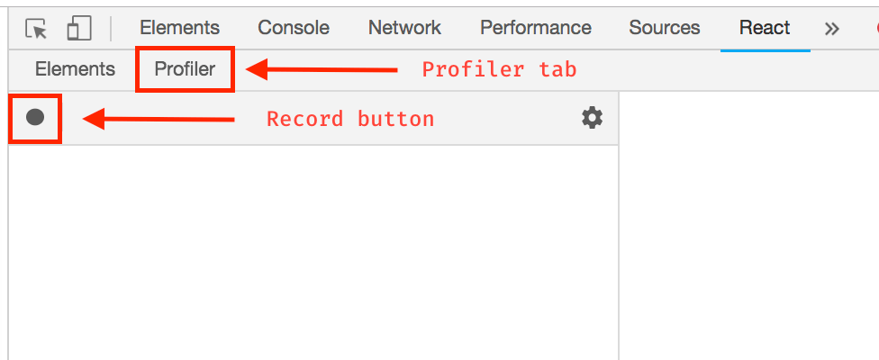
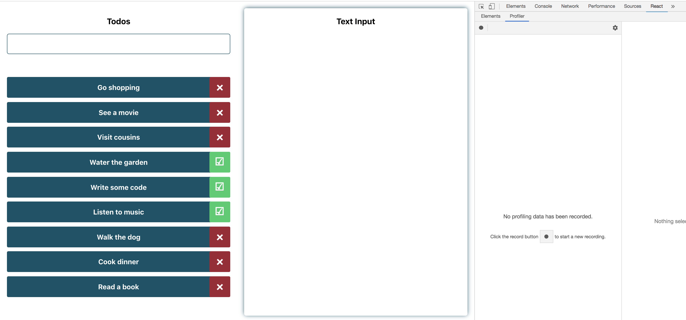
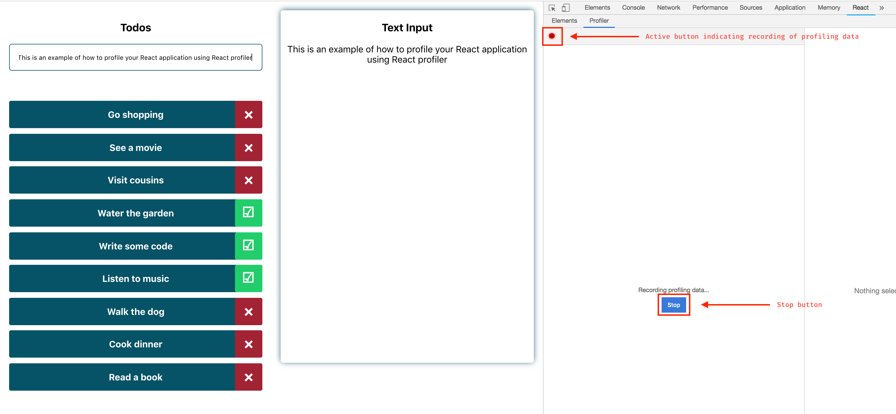
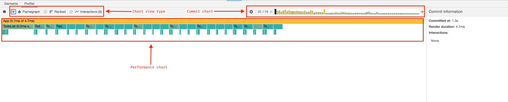
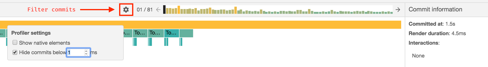
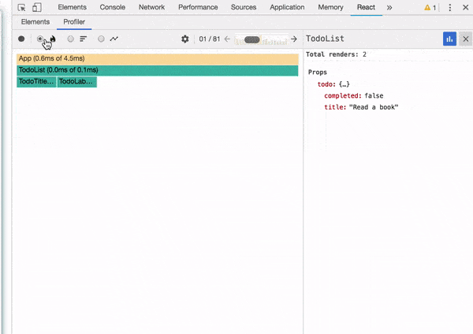
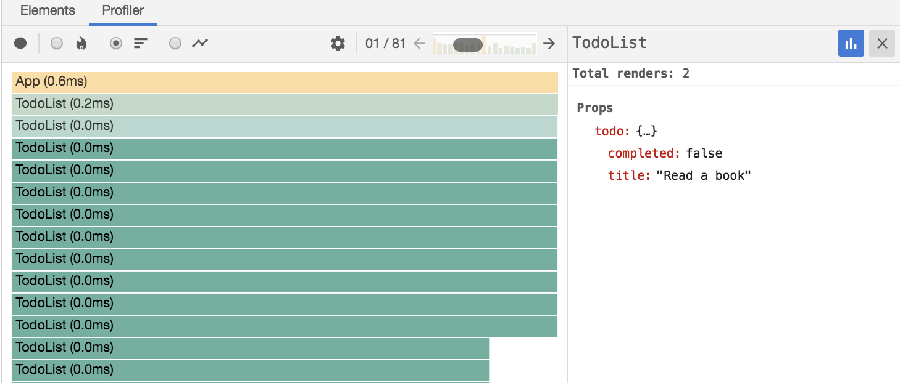
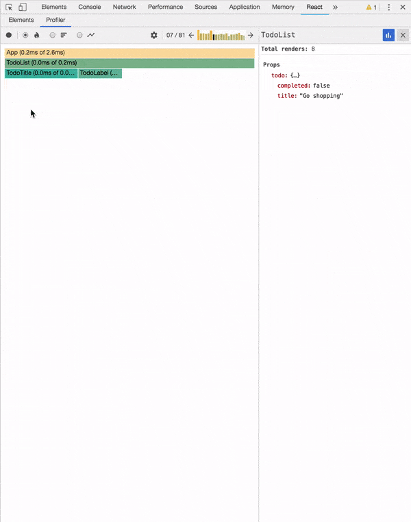

이 글은 Christian Nwamba의 **Performance Profiling Your React App**을 번역한 글입니다.  
원문: https://www.telerik.com/blogs/performance-profiling-your-react-app
  

---

 

React는 프론트엔드 개발을 위한 멋진 프레임 워크입니다. 이는 우리가 고통없이 인터렉티브한 UI를 만드는 데 도움을 줍니다. 또한 React는 Virtual DOM을 사용하여 변경 사항을 효율적으로 DOM에 적용시킵니다.

그러나 우리는 코드를 작성할 때 우리도 모르게 성능 문제를 유도합니다. 이러한 성능 문제를 해결하기 위해서는 성능 문제를 발견할 수 있어야 합니다.

이 글에서는 React Profiler를 사용하여 React 애플리케이션의 성능을 프로파일링하는 방법을 배울 수 있습니다.

오늘 날 웹은 초당 60 프레임 이상의 렌더링을 처리하면 성능이 좋다 말합니다. 그보다 적으면 "jank"를 유도하고 전반적인 사용자 경험이 느려질 것입니다.

# Prerequisites

⚠️ 이 글을 읽으려면 기본적인 React 지식이 필요합니다. 또한 React DevTools에 익숙해야 합니다.

# React Profiler

React 16.5 이후로 DevTools Profiler 플러그인에 대한 지원이 추가되었습니다. 이 플러그인은 성능 병목 현상을 식별하기 위해 렌더링 된 구성 요소에 대한 타이밍 정보를 수집합니다.

React는 **commit** 단계에서 변경 사항들을 DOM에 적용합니다. Profiler는 commit 별로 성능을 그룹화하여 각 변경 사항의 비용이 얼마나 많은지 보여줍니다.

# Accessing React Profiler

React Profiler를 지원하는 React 애플리게이션을 실행 중인 경우 React DevTools를 열면 "Profiler"탭이 표시됩니다. 탭을 클릭하면 앱 성능을 기록하는 레코드 버튼이 표시됩니다:

# Profiling A React Application

React Profiler를 사용하여 프로파일링하는 방법을 설명하기 위해 Create React App을 통해 작성된 간단한 to-do 애플리케이션을 사용할 것입니다.

to-do 애플리케이션에는 입력 필드가 있으며 하드 코딩 된 to-do 목록이 렌더링됩니다. 입력 필드에 입력된 값은 페이지의 다른 섹션에 표시됩니다:

애플리케이션의 성능을 기록하려면 레코드 버튼을 클릭 한 다음 평상시처럼 앱을 사용하십시오. 기록을 시작하면 React Profiler는 애플리케이션이 렌더링 될 때마다 정보를 수집합니다. 프로파일링을 끝내려면 중지 버튼을 클릭하십시오:

# Reading Performance Data

중지 버튼을 클릭하면 프로파일러 탭이 Flamegraph 형식의 성능 데이터로 채워집니다. 데이터에는 **commit chart, chart view selector** 및 **performance chart view** 섹션이 있습니다:

# Commit Chart

Commit chart는 탭의 오른쪽 상단에 있습니다. 프로파일링을 진행하는 동안 실행된 모든 commit을 포함합니다.

차트의 각 막대는 각각의 단일 commit을 나타냅니다. 막대의 높이와 색상은 commit이 렌더링되는 데에 걸린 시간을 나타냅니다. (길고 노란 막대는 렌더링이 오래 걸린 commit이고, 짧고 파란색인 막대는 렌더링하는 데 좀 더 짧은 시간이 걸린 commit을 나타냅니다.)

막대를 선택할 수 있으며 (선택한 막대는 검정색으로 표시됩니다) 해당되는 commit 정보를 볼 수 있습니다:

위 이미지에서는 81 개의 commit이 있었음을 알 수 있습니다. 현재 선택된 commit은 렌더링에 4.5ms가 걸렸으며 아무런 상호 작용(interactions)이 없었습니다.
이런 경우처럼 commit 수가 너무 많은 경우에는 위 이미지에 표시된 톱니 바퀴 아이콘을 클릭하여 commit을 필터링할 수 있습니다.
이 기능은 입력한 ms값(Render duration)보다 덜 소요된 commit들을 숨길 수 있습니다.

# Browsing Commits

Commit은 flame charts, ranked charts, component charts 및 interactions으로 구성되어 있습니다. 이러한 다양한 보기들은 애플리케이션의 성능을 볼 수 있는 다양한 화면들을 제공합니다. Commit 막대를 클릭하면 chart 영역에 해당 commit에 대한 데이터가 표시됩니다.

## Flame Chart

Flame chart는 특정 commit에 대한 애플리케이션의 state를 나타냅니다. 각 막대는 각각의 컴포넌트를 나타내며 막대의 너비는 컴포넌트와 자식 컴포넌트가 렌더링되는 데 소요된 시간을 나타냅니다.

막대의 색상 또한 각 컴포넌트가 렌더링되는 데 소요된 시간을 나타냅니다. 노란색 컴포넌트는 시간이 더 오래 걸렸음을 파란색 컴포넌트는 시간이 덜 걸렸음을 회색 구성 요소는 commit 중에 전혀 렌더링되지 않았음을 알려줍니다.

컴포넌트를 클릭하면 오른쪽에 위치한 세부 정보 패널에 해당되는 commit의 정보가 표시됩니다:

## Ranked Chart

Ranked chart는 각 컴포넌트들을 단일 commit으로 표시하며 렌더링하는 데 오래 걸린 순으로 순위가 매겨집니다. 렌더링하는 데 오래 걸린 컴포넌트가 맨 위에 위치합니다. 이 차트를 보려면 프로파일러 탭의 왼쪽 상단 모서리에 있는 ranked chart 라디오 버튼을 클릭하십시오. Flame chart와 마찬가지로 컴포넌트를 클릭하여 순위가 매겨진 차트를 확대하거나 축소할 수 있습니다:

## Component Chart

Component chart는 프로파일링이 진행되는 동안의 컴포넌트 렌더링 주기 정보를 제공합니다. 이 정보를 막대 차트 형태로 표시합니다. 각 막대는 컴포넌트가 렌더링 된 시간을 나타냅니다. 프로파일링 세션 중에 선택한 컴포넌트가 전혀 렌더링되지 않았으면 이를 나타내는 메시지가 표시됩니다.

Component chart를 보려면 컴포넌트를 더블 클릭하거나 컴포넌트를 선택하고 오른쪽의 세부 정보 창에서 파란색 막대 차트 아이콘을 클릭하십시오. 오른쪽의 세부 정보 창에서 'x'버튼을 클릭하면 이전 차트로 돌아갈 수 있습니다:

## Interaction Chart

Interaction chart는 업데이트의 원인을 추적하여 프로파일러 탭에 표시해주는 [시험용 API](https://gist.github.com/bvaughn/8de925562903afd2e7a12554adcdda16)입니다.

# Common Problems With React Profiler

- 어플리케이션에 여러 개의 root가 있으면 프로파일링 후에 다음의 오류가 발생할 수 있습니다: **No profiling data has been recorded for the selected root.** 이 오류가 발생하면 **elements** 패널에서 다른 root를 선택하여 해당 root에 대한 프로파일링 정보를 보십시오.
- 때로는 commit이 너무 빨라서 React Profiler가 의미있는 정보를 얻지 못할 수도 있습니다. 이 경우에는 다음의 오류가 발생합니다: **No timing data to display for the selected commit.**

# Conclusion

이 글에서는 React Profiler를 사용하여 React 애플리케이션의 성능을 프로파일링하는 방법을 배웠습니다. 저는 당신이 이 글을 통해 더 훌륭한 리액트 애플리케이션을 개발하는 데 도움이 되었으면 합니다.

# For More on Building React Apps

React에 대해 더 알고나서 React 애플리케이션 개발을 시작하시겠습니까? 그렇다면 다음 자료를 통해 더 자세한 내용을 확인하십시오:

- [Hello, Create React App](https://www.telerik.com/blogs/hello-create-react-app-2)
- [All Things React](https://www.telerik.com/blogs/all-things-react)
- [KendoReact—UI for React developers](https://www.telerik.com/kendo-react-ui/)

 
 
