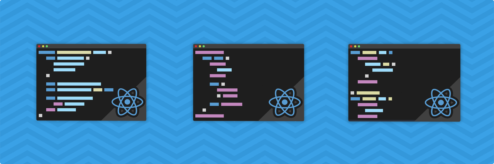

이 글은 Gustavo Matheus의 React Component Patterns을 번역한 글입니다.  
원문: https://levelup.gitconnected.com/react-component-patterns-ab1f09be2c82
<br><br>

---

<br>

저는 **React**(JavaScript를 사용해 사용자 인터페이스를 개발하는 페이스북 라이브러리)를 사용하며 개발하는 동안 알고 싶었던 몇 가지 개념들이 있었습니다. 이 글은 지금까지 개발하며 배운 몇 가지 패턴을 요약하려는 시도이며, 멋진 컴포넌트 기반의 세계에 입문할 개발자 분들에게 유용할 것입니다.



# Stateful x Stateless Components

React의 컴포넌트들은 Stateful 및 Stateless 웹 서비스들처럼 애플리케이션이 작동하는 동안 **state**를 유지하고 다룰 수 있습니다. **(Stateful)** — 또는 전달된 **props**를 가져와 보여주는 단순한 컴포넌트 일 수도 있습니다. **(Stateless)**

<br>

props에 의존적인 **Stateless** \<Button\> 컴포넌트

```jsx
const Button = props =>
  <button onClick={props.onClick}>
    {props.text}
  </button>
```
<br>

state를 다루는 **Stateful** \<ButtonCounter\> 컴포넌트 (위의 Button 컴포넌트를 재사용)

```jsx
class ButtonCounter extends React.Component {
  constructor() {
    super()
    this.state = { clicks: 0 }
    this.handleClick = this.handleClick.bind(this)
  }

  handleClick() {
    this.setState({ clicks: this.state.clicks + 1 })
  }

  render() {
    return (
      <Button
        onClick={this.handleClick}
        text={`You've clicked me ${this.state.clicks} times!`}
      />
    )
  }
}
```

보시다시피 마지막 컴포넌트의 constructor에서는 state를 가지고 있는 반면, 첫 번째 컴포넌트는 단지 props를 통해 text만 렌더링 해주는 간단한 컴포넌트입니다. 이러한 방식은 단순해 보이지만, \<Button\> 컴포넌트를 재사용할 수 있도록 도와줍니다.

# Container x Presentational Components

외부 데이터를 가지고 작업할 때, 우리는 컴포넌트를 두 가지 카테고리로 분류할 수 있습니다. **Container**는 리액트를 Redux나 Relay에 연결하는 것처럼 외부에서 들어오는 데이터를 관리합니다. 반면에 **Presentational** 컴포넌트는 앱의 다른 의존성 없이, state 또는 props 만을 사용합니다.

유저 리스트를 가져오는 **Presentational 컴포넌트**의 예제를 한 번 봅시다.

```jsx
const UserList = props =>
  <ul>
    {props.users.map(u => (
      <li>{u.name} — {u.age} years old</li>
    ))}
  </ul>
```

위의 유저 리스트는 아래의 Container 컴포넌트를 통해 업데이트할 수 있습니다.

```jsx
class UserListContainer extends React.Component {
  constructor() {
    super()
    this.state = { users: [] }
  }

  componentDidMount() {
    fetchUsers(users => this.setState({ users }))
  }

  render() {
    return <UserList users={this.state.users} />
  }
}
```

이 패턴은 데이터를 가져오는 로직을 렌더링으로부터 분리하고, \<UserList\>를 재사용할 수 있도록 만들어 줍니다. 당신이 이 패턴에 대해 더 자세하고 정확히 알길 원한다면, [Dan Abramov의 글](https://medium.com/@dan_abramov/smart-and-dumb-components-7ca2f9a7c7d0)이 도움이 될 것입니다.


# Higher-Order Components

Higher-Order Components (이하 **HOCs**)는 당신이 컴포넌트의 로직을 재사용하길 원할 때 유용합니다. 이 것은 컴포넌트를 매개변수로 받아 새로운 컴포넌트를 리턴해주는 Javascript function입니다.

확장 가능한 메뉴 컴포넌트가 필요하다고 가정해봅시다. 이 컴포넌트는 사용자가 콘텐츠를 클릭했을 때, children content를 펼쳐 보여줄 것입니다. 이때, 당신은 부모 컴포넌트를 통해 state를 관리하지 않고 간단히 **HOC**를 통해 처리할 수 있습니다.

```jsx
function makeToggleable(Clickable) {
  return class extends React.Component {
    constructor() {
      super()
      this.toggle = this.toggle.bind(this)
      this.state = { show: false }
    }

    toggle() {
      this.setState(prevState => ({ show: !prevState.show }))
    }

    render() {
      return (
        <div>
          <Clickable
            {...this.props}
            onClick={this.toggle}
          />
          {this.state.show && this.props.children}
        </div>
      )
    }
  }
}
```

이러한 패턴은 Javascript **decorator** syntax를 사용해서, 우리가 만든 기능을 **\<ToggleableMenu\>** 컴포넌트에도 적용할 수 있도록 해줍니다.

```jsx
@makeToggleable
class ToggleableMenu extends React.Component {
  render() {
    return (
      <div onClick={this.props.onClick}>
        <h1>{this.props.title}</h1>
      </div>
    )
  }
}
```

이제 **\<ToggleableMenu\>** 컴포넌트를 이용해서 children 요소들을 전달할 수 있습니다.

```jsx
class Menu extends React.Component {
  render() {
    return (
      <div>
        <ToggleableMenu title="First Menu">
          <p>Some content</p>
        </ToggleableMenu>
        <ToggleableMenu title="Second Menu">
          <p>Another content</p>
        </ToggleableMenu>
        <ToggleableMenu title="Third Menu">
          <p>More content</p>
        </ToggleableMenu>
      </div>
    )
  }
}
```

만약 당신이 [Redux](https://redux.js.org/)의 **connect** 또는 [React Router](https://github.com/ReactTraining/react-router)의 **withRouter**에 익숙하다면 이미 **HOCs**를 사용하고 있는 것입니다!

# Render Callbacks

또 다른 훌륭한 방법은 컴포넌트의 children을 함수로 정의해서 컴포넌트를 재사용할 수 있도록 만드는 것입니다. 그렇기 때문에 **Render Callbacks**는 **Function as Child Components**라고도 불립니다. 또한 위에서 본 **HOC** 예제(ToggleableMenu)를 **Render Callback** 패턴으로 재작성할 수 있습니다.

```jsx
class Toggleable extends React.Component {
  constructor() {
    super()
    this.toggle = this.toggle.bind(this)
    this.state = { show: false }
  }

  toggle() {
    this.setState(prevState => ({ show: !prevState.show }))
  }

  render() {
    return this.props.children(this.state.show, this.toggle)
  }
}
```

이제 **\<Toggleable\>** 컴포넌트의 children을 함수로 전달할 수 있습니다.

```jsx
<Toggleable>
  {(show, onClick) => (
    <div>
      <div onClick={onClick}>
        <h1>First Menu</h1>
      </div>
      {show ?
        <p>Some content</p>
        : null
      }
    </div>
  )}
</Toggleable>
```

위 예제에서는 이미 children에 함수를 사용하고 있습니다만, **HOC** 예제(multiple 메뉴)처럼 재사용도 하고 싶다면, **\<Toggleable\>**를 사용하는 새로운 컴포넌트를 만들기만 하면 됩니다.

```jsx
const ToggleableMenu = props =>
  <Toggleable>
    {(show, onClick) => (
      <div>
        <div onClick={onClick}>
          <h1>{props.title}</h1>
        </div>
        {show && props.children}
      </div>
    )}
  </Toggleable>
```

자, 이제 새로운 **\<ToggleableMenu\>** 컴포넌트를 사용할 준비가 되었습니다.

```jsx
class Menu extends React.Component {
  render() {
    return (
      <div>
        <ToggleableMenu title="First Menu">
          <p>Some content</p>
        </ToggleableMenu>
        <ToggleableMenu title="Second Menu">
          <p>Another content</p>
        </ToggleableMenu>
        <ToggleableMenu title="Third Menu">
          <p>More content</p>
        </ToggleableMenu>
      </div>
    )
  }
}
```

보세요! 우리의 **\<Menu\>** 컴포넌트는 **HOC**에서 사용한 예제와 똑같아 보입니다!  
  
이 패턴은 state 조작에 관계없이 렌더링 되는 내용 자체를 변경하려는 경우에 정말 유용합니다.
위 예제에서 볼 수 있듯이 렌더링 하는 로직을 **\<ToggleableMenu\>** 컴포넌트의 children 함수로 이동했지만 state는 **\<Toggleable\>** 컴포넌트에서 관리하도록 유지했습니다!


# Further Reading

위의 예제는 **React**에서 사용할 수 있는 패턴들의 기초 일 뿐입니다. 이 주제에서 더 자세히 알기를 원한다면, 아래의 훌륭한 링크들을 참고하시길 바랍니다.

[React Component Patterns by Michael Chan](https://www.youtube.com/watch?v=YaZg8wg39QQ)  
[React Patterns](https://github.com/chantastic/reactpatterns.com)  
[Presentational and Container Components](https://medium.com/@dan_abramov/smart-and-dumb-components-7ca2f9a7c7d0)  
[React Higher Order Components in depth](https://medium.com/@franleplant/react-higher-order-components-in-depth-cf9032ee6c3e)  
[Function as Child Components](https://medium.com/merrickchristensen/function-as-child-components-5f3920a9ace9)  
[Recompose](https://github.com/acdlite/recompose)  
[Downshift](https://github.com/paypal/downshift)  

<br>
<br>
